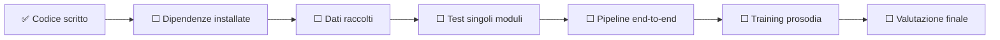

# Prossimi Passi — Telecronaca AI per FIFA

## Dove Siamo Ora

Il codice dei 4 moduli è stato scritto ma **non è mai stato eseguito**. Le directory dei dati sono vuote. Nessuna dipendenza è stata installata nel progetto.



| Componente | File | Stato |
|-----------|------|-------|
| Setup | [00_demo_setup.py](file:///Users/federicoledonne/Sarcasm-Detection/src/00_demo_setup.py) | Scritto, non testato |
| OCR HUD | [01_extract_events.py](file:///Users/federicoledonne/Sarcasm-Detection/src/01_extract_events.py) | Scritto, non testato |
| Visione (YOLO) | [01b_visual_analysis.py](file:///Users/federicoledonne/Sarcasm-Detection/src/01b_visual_analysis.py) | Scritto, non testato |
| Audio (Librosa + Whisper) | [01c_audio_analysis.py](file:///Users/federicoledonne/Sarcasm-Detection/src/01c_audio_analysis.py) | Scritto, non testato |
| Generazione LLM | [02b_generate_llm.py](file:///Users/federicoledonne/Sarcasm-Detection/src/02b_generate_llm.py) | Scritto, non testato |
| TTS | [04_synthesize.py](file:///Users/federicoledonne/Sarcasm-Detection/src/04_synthesize.py) | Scritto, non testato |
| Training prosodia | [03_train_prosody.py](file:///Users/federicoledonne/Sarcasm-Detection/src/03_train_prosody.py) | Scritto, non testato |
| Valutazione | [05_evaluate.py](file:///Users/federicoledonne/Sarcasm-Detection/src/05_evaluate.py) | Scritto, non testato |

---

## Passo 1: Setup Ambiente (⏱️ ~30 min)

### 1.1 Creare un virtual environment

```bash
cd /Users/federicoledonne/Sarcasm-Detection
python3 -m venv .venv
source .venv/bin/activate
```

### 1.2 Installare le dipendenze

```bash
pip install -r requirements.txt
```

> [!WARNING]
> **Dipendenze pesanti**: `ultralytics` (YOLOv8), `openai-whisper`, e `torch` scaricano diversi GB. Serve una connessione stabile. Se hai una GPU NVIDIA, installa anche `torch` con supporto CUDA per velocizzare enormemente YOLO e Whisper.

### 1.3 Installare ffmpeg (necessario per audio)

```bash
# macOS
brew install ffmpeg
```

### 1.4 Eseguire lo script di setup

```bash
python src/00_demo_setup.py
```

Questo crea le directory del progetto (`data/raw/gameplay/`, `features/`, `models/`, `outputs/`) e verifica le dipendenze.

### 1.5 Decisione: LLM Provider

> [!IMPORTANT]
> **Quale LLM volete usare?**

| Provider | Costo | Setup | Qualità |
|----------|-------|-------|---------|
| **Ollama + LLaMA 3** (raccomandato) | Gratuito | `brew install ollama && ollama pull llama3` | Buona |
| OpenAI GPT-4 | ~$0.03/evento | `export OPENAI_API_KEY='sk-...'` | Ottima |
| Anthropic Claude | ~$0.03/evento | `export ANTHROPIC_API_KEY='sk-...'` | Ottima |

Se scegliete Ollama:
```bash
# Installa Ollama
brew install ollama

# Scarica il modello (~4.7GB)
ollama pull llama3

# Avvia il server (lascialo in esecuzione)
ollama serve
```

---

## Passo 2: Raccolta Dati (⏱️ ~15 min)

### 2.1 Registrare una clip di FIFA

Serve almeno **un video di gameplay** di EA FC / FIFA (anche 2-3 minuti bastano per testare).

**Come registrarlo:**
- **PS5**: premi il tasto Share → Salva Video Clip
- **PC**: usa OBS Studio o la Game Bar di Windows (Win+G)
- **Xbox**: premi il tasto Xbox → Registra
- **YouTube**: scarica una clip di gameplay con `yt-dlp` (per testing)

```bash
# Opzione rapida: scaricare una clip da YouTube (solo per testing)
pip install yt-dlp
yt-dlp -f "best[height<=720]" -o "data/raw/gameplay/match1.mp4" "URL_DEL_VIDEO"
```

> [!NOTE]
> Per il testing iniziale va bene qualsiasi video di FIFA. Per risultati migliori, usate la vostra telecronaca reale dove l'HUD è visibile e la qualità video è almeno 720p.

### 2.2 Posizionare il video

```bash
# Il video va messo qui:
data/raw/gameplay/match1.mp4
```

### 2.3 (Opzionale) Clip di telecronaca per voice cloning

Se volete che la voce sintetica imiti un telecronista specifico, servite un clip audio di 10-30 secondi:

```bash
data/raw/commentary/speaker_reference.wav
```

---

## Passo 3: Test del Modulo Visivo — YOLO (⏱️ ~20 min)

Questo è il test più critico. Dobbiamo verificare che YOLOv8 riesca a rilevare giocatori e palla nelle clip di FIFA.

### 3.1 Test rapido su un singolo frame

```bash
python -c "
from ultralytics import YOLO
import cv2

model = YOLO('yolov8n.pt')
frame = cv2.imread('data/raw/gameplay/match1_frame.png')  # screenshot
results = model(frame, conf=0.3)
results[0].show()  # mostra le detection
results[0].save('test_yolo_output.jpg')
print(f'Rilevati {len(results[0].boxes)} oggetti')
for box in results[0].boxes:
    cls = int(box.cls[0])
    conf = float(box.conf[0])
    name = model.names[cls]
    print(f'  {name}: {conf:.2f}')
"
```

### 3.2 Possibili risultati e soluzioni

| Risultato | Cosa fare |
|-----------|-----------|
| ✅ Rileva giocatori e palla | Perfetto, procedere |
| ⚠️ Rileva giocatori ma NON la palla | Abbassare la confidence (`conf=0.15`), oppure aggiungere ball tracking con colore (OpenCV) |
| ⚠️ Troppi falsi positivi (rileva l'HUD come persone) | Mascherare la zona HUD prima della detection |
| ❌ Non rileva quasi nulla | Fine-tuning necessario (vedi Passo 3.3) |

### 3.3 (Se necessario) Fine-tuning YOLO su FIFA

Solo se il test 3.1 mostra risultati insufficienti:

1. Catturare ~200 screenshot da FIFA
2. Annotarli con [Roboflow](https://roboflow.com/) (gratuito, interfaccia web)
3. Esportare in formato YOLO
4. Fine-tuning:

```bash
yolo detect train data=dataset_fifa.yaml model=yolov8n.pt epochs=50 imgsz=640
```

> [!TIP]
> **Previsione realistica**: con EA FC 24/25, YOLO pre-trained dovrebbe rilevare i giocatori con ~80%+ accuracy. La palla è il punto debole (troppo piccola nella visuale classica). Se la palla non viene rilevata, non è un problema bloccante — il sistema può funzionare solo con le detection dei giocatori + OCR dell'HUD.

---

## Passo 4: Test del Modulo Audio (⏱️ ~15 min)

### 4.1 Test crowd excitement

```bash
python src/01c_audio_analysis.py --video data/raw/gameplay/match1.mp4 --no-whisper
```

Output atteso: `features/events/match1_audio.json` con livelli di eccitazione del tifo per ogni finestra temporale.

### 4.2 Test Whisper (trascrizione)

```bash
python src/01c_audio_analysis.py --video data/raw/gameplay/match1.mp4
```

> [!NOTE]
> Whisper scarica il modello (~140MB per `base`) alla prima esecuzione. La trascrizione di un video di 3 minuti richiede ~1 minuto su CPU, ~10 secondi su GPU.

### 4.3 Possibili problemi

| Problema | Soluzione |
|----------|-----------|
| ffmpeg non trovato | `brew install ffmpeg` |
| Whisper troppo lento | Usare `--no-whisper` per saltare la trascrizione, oppure cambiare `WHISPER_MODEL_SIZE = "tiny"` in config.py |
| Crowd excitement sempre "low" | Regolare `CROWD_EXCITEMENT_THRESHOLDS` in config.py |

---

## Passo 5: Test Pipeline Completa (⏱️ ~30 min)

### 5.1 Percorso minimo (solo OCR + template + TTS)

Il percorso più semplice per avere un risultato audio:

```bash
# Fase 1: Estrai eventi dall'HUD
python src/01_extract_events.py --video data/raw/gameplay/match1.mp4 --limit 50

# Fase 2: Genera script con template
python src/02_generate_script.py --events features/events/match1.json

# Fase 4: Sintetizza audio (flat, senza prosodia)
python src/04_synthesize.py --script features/scripts/match1.json --mode flat --tts pyttsx3
```

**Output**: `outputs/audio/match1_flat.wav` — la tua prima telecronaca AI! 🎙️

### 5.2 Percorso arricchito (tutti i moduli)

```bash
# Fase 1: OCR HUD
python src/01_extract_events.py --video data/raw/gameplay/match1.mp4

# Fase 1b: Analisi visiva (YOLO)
python src/01b_visual_analysis.py --video data/raw/gameplay/match1.mp4 \
    --merge features/events/match1.json

# Fase 1c: Analisi audio
python src/01c_audio_analysis.py --video data/raw/gameplay/match1.mp4 \
    --events features/events/match1_enriched.json

# Fase 2b: Generazione con LLM
python src/02b_generate_llm.py --events features/events/match1_enriched.json \
    --provider ollama

# Fase 4: Sintesi con prosodia rule-based
python src/04_synthesize.py --script features/scripts/match1_llm.json \
    --mode rule --tts pyttsx3
```

### 5.3 Calibrazione HUD (probabile fix necessario)

> [!WARNING]
> Le regioni HUD in [config.py](file:///Users/federicoledonne/Sarcasm-Detection/src/config.py) (`HUD_REGIONS`) sono coordinate **normalizzate** che indicano dove leggere il punteggio e il nome del giocatore sullo schermo. Queste coordinate dipendono dalla **versione di FIFA** e dalla **risoluzione** del video. Quasi certamente vanno ricalibrate.

Come calibrare:
1. Aprire un frame del video con un editor d'immagini
2. Trovare le coordinate (in pixel) del box del punteggio e del nome giocatore
3. Dividere per larghezza/altezza del frame per ottenere coordinate normalizzate
4. Aggiornare `config.HUD_REGIONS` nel file [config.py](file:///Users/federicoledonne/Sarcasm-Detection/src/config.py)

---

## Passo 6: Training della Prosodia (⏱️ ~1-2 ore)

> [!IMPORTANT]
> Questo passo richiede un **dataset annotato** di telecronache con parametri prosodici (velocità, tono, volume). Se non avete dati reali, potete usare i dati sintetici generati da `00_demo_setup.py`, ma i risultati saranno limitati.

### 6.1 Costruire il dataset

```bash
python src/03_train_prosody.py build-dataset
```

### 6.2 Addestrare il modello

```bash
python src/03_train_prosody.py train
```

### 6.3 Usare la prosodia appresa

```bash
python src/04_synthesize.py --script features/scripts/match1_llm.json --mode learned
```

Ora potete confrontare i 3 file audio:
- `match1_flat.wav` — baseline piatta
- `match1_rule.wav` — prosodia da regole
- `match1_learned.wav` — prosodia appresa dal modello

---

## Passo 7: Valutazione (⏱️ ~30 min)

```bash
python src/05_evaluate.py
```

Questo esegue uno studio A/B dove degli ascoltatori valutano quale telecronaca suona meglio (flat vs rule vs learned).

---

## Problemi Noti e Soluzioni

### 🔴 Critici

| # | Problema | Impatto | Soluzione |
|---|---------|---------|-----------|
| 1 | **HUD_REGIONS non calibrate** | OCR non legge nulla | Calibrare manualmente (vedi Passo 5.3) |
| 2 | **YOLO non rileva la palla di FIFA** | Nessun evento visivo "shot_on_goal" | Abbassare confidence, o usare color tracking |
| 3 | **Nessun video di FIFA** | Non si può testare nulla | Registrare o scaricare una clip (Passo 2) |

### 🟡 Medi

| # | Problema | Impatto | Soluzione |
|---|---------|---------|-----------|
| 4 | **pyttsx3 voce robotica** | Telecronaca suona innaturale | Passare a Coqui XTTS (`--tts coqui`) |
| 5 | **Ollama non installato** | LLM non funziona | Installare Ollama (Passo 1.5) o usare template (Fase 2 invece di 2b) |
| 6 | **Import errors** | Moduli non trovati | Verificare che il PYTHONPATH includa `src/` |

### 🟢 Minori

| # | Problema | Impatto | Soluzione |
|---|---------|---------|-----------|
| 7 | **Dataset prosodia sintetico** | Modello appreso poco utile | Raccogliere annotazioni reali |
| 8 | **Whisper lento su CPU** | Fase 1c richiede minuti | Usare `--no-whisper` o GPU |

---

## Roadmap Riassuntiva

```mermaid
gantt
    title Roadmap Telecronaca AI per FIFA
    dateFormat X
    axisFormat %s

    section Setup
    Virtual env + dipendenze           :a1, 0, 30
    Installare Ollama + ffmpeg          :a2, 0, 15
    Scaricare/registrare video FIFA     :a3, 0, 15

    section Test Singoli
    Test YOLO su frame FIFA             :b1, 30, 50
    Test Audio (crowd + whisper)        :b2, 30, 45
    Calibrazione HUD                    :b3, 45, 60

    section Pipeline
    Pipeline minima (OCR+template+TTS)  :c1, 60, 80
    Pipeline arricchita (tutti i moduli):c2, 80, 110

    section Training
    Build dataset prosodia              :d1, 110, 130
    Training modello                    :d2, 130, 150

    section Valutazione
    Confronto flat/rule/learned         :e1, 150, 170
    Studio A/B                          :e2, 170, 190
```



---

## Decisioni Da Prendere

> [!IMPORTANT]
> Prima di procedere, servono queste decisioni:

1. **Video di FIFA**: avete già un video, oppure devo predisporre il download di una clip da YouTube per testing?
2. **LLM**: Ollama (gratuito, locale) o API cloud (GPT-4/Claude)?
3. **TTS**: pyttsx3 (semplice) o Coqui XTTS (qualità migliore ma ~2GB)?
4. **GPU disponibile?** Cambia molto la velocità di YOLO, Whisper e training

---

> [!TIP]
> **Consiglio pratico**: partite dal **Passo 5.1** (percorso minimo) per avere un risultato funzionante il prima possibile, poi arricchite un modulo alla volta. Ogni modulo aggiunto è un miglioramento dimostrabile al lab.
